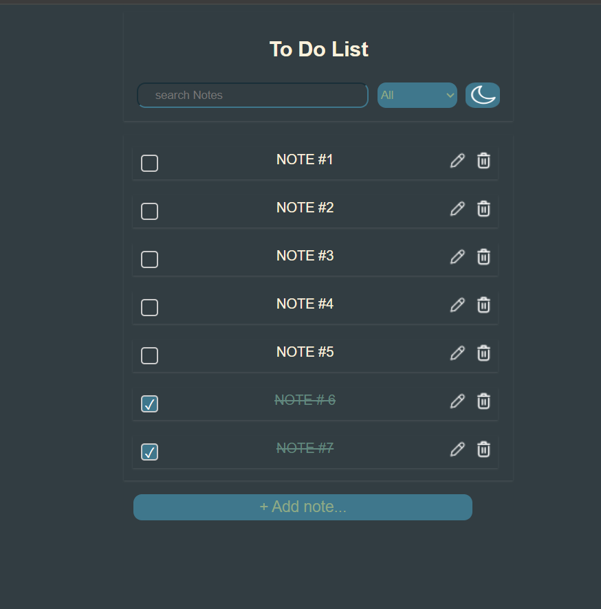
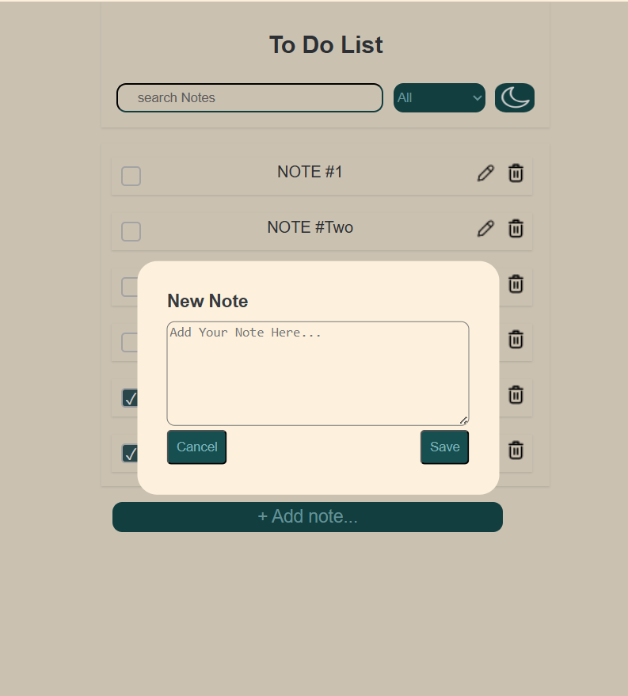
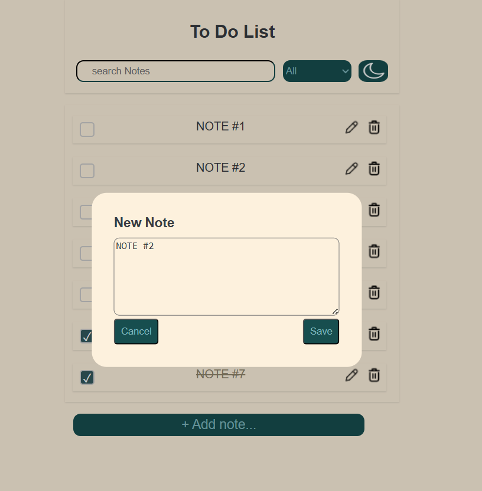
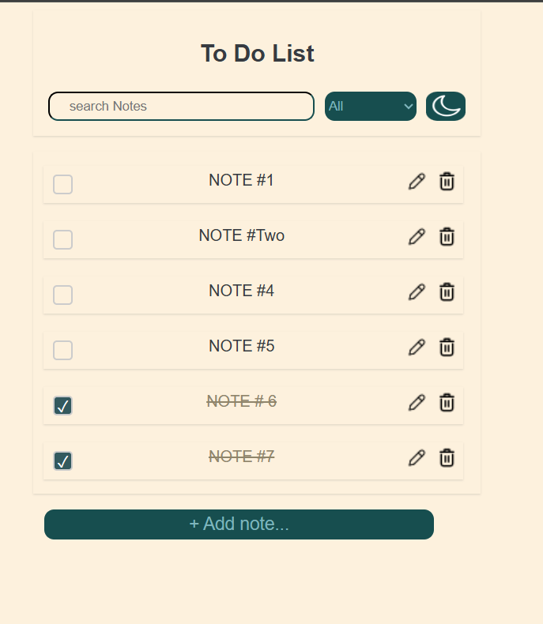
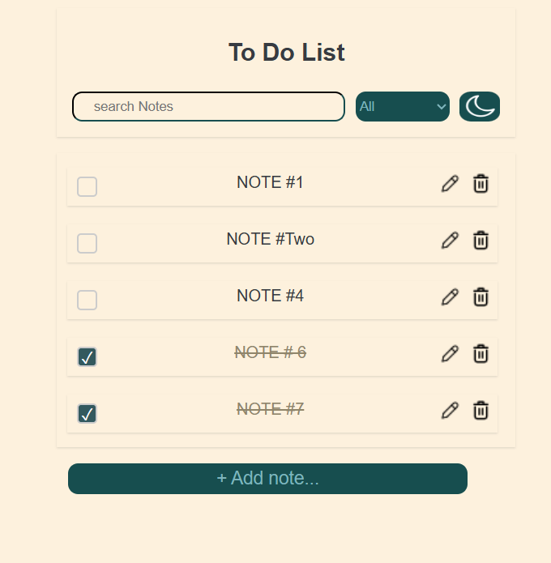
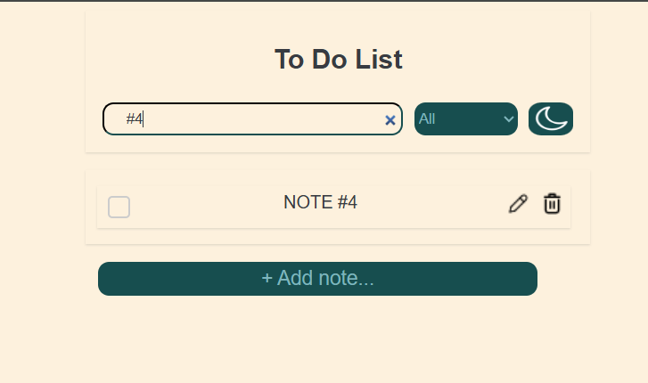
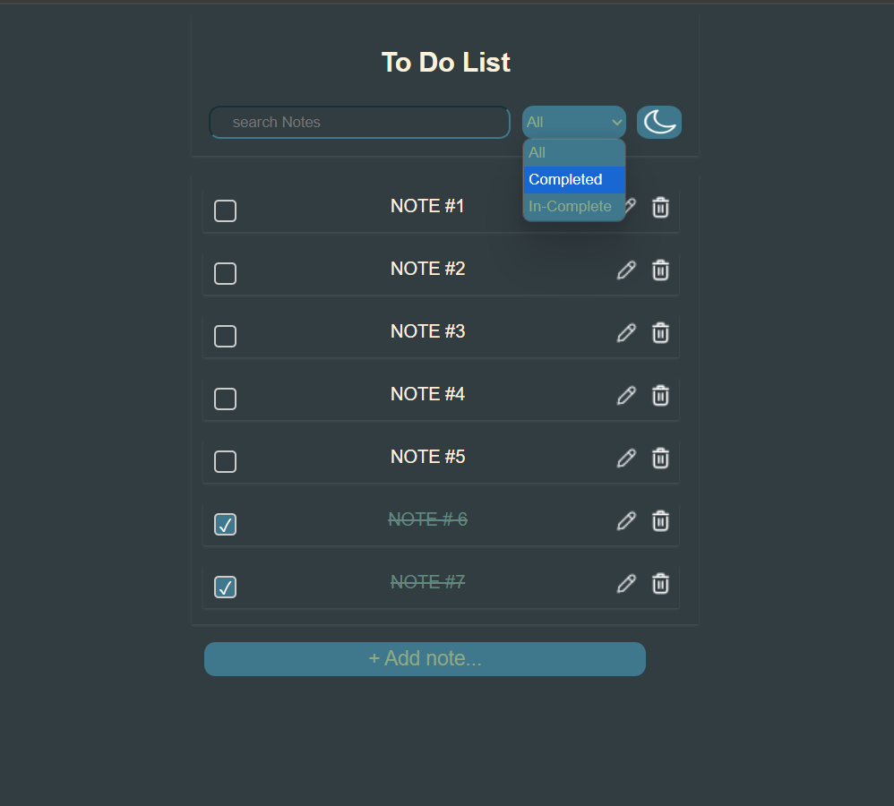
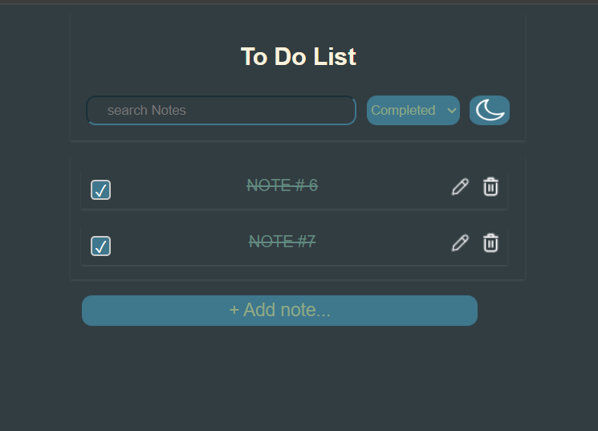
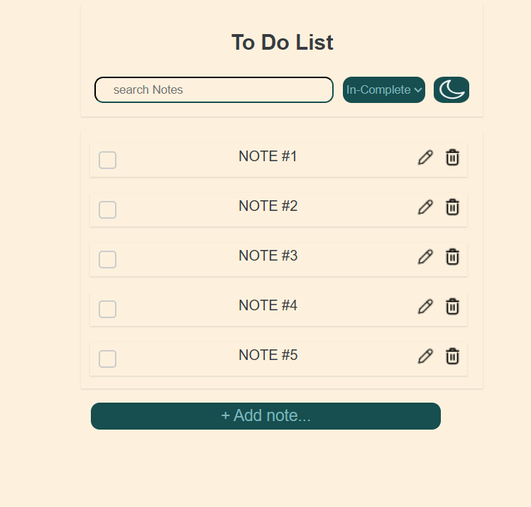

# To-Do List Application

A simple yet powerful To-Do List application built with **HTML**, **CSS**, and **JavaScript**. This application allows users to manage their tasks efficiently with features like adding, editing, and deleting notes. It also supports **dark and light themes**, **search functionality**, and **categorization** of tasks into **Incomplete**, **Completed**, and **All**.

---

## Features

### 1. **Add Notes**
   - Easily add new tasks to your to-do list.
   - Input field with a placeholder for quick note-taking.

### 2. **Edit Notes**
   - Edit existing notes in place without deleting and re-adding them.
   - Simple and intuitive interface for quick updates.

### 3. **Delete Notes**
   - Remove tasks you no longer need with a single click.

### 4. **Dark and Light Mode**
   - Switch between **dark** and **light** themes based on your preference.
   - Theme preference is saved in `localStorage` for persistence across sessions.

### 5. **Search Functionality**
   - Quickly find tasks using the search bar.
   - Real-time filtering of notes as you type.

### 6. **Categorization**
   - Organize tasks into three categories:
     - **Incomplete**: Tasks that are yet to be completed.
     - **Completed**: Tasks that have been marked as done.
     - **All**: Display all tasks regardless of their status.

### 7. **Responsive Design**
   - The application is designed to work seamlessly on both desktop and mobile devices.

---

## Screenshots

### Light Theme

*The application in light mode with a clean and minimal design.*

### Dark Theme

*The application in dark mode for a sleek and modern look.*

### Add Note

*Adding a new task to the to-do list.*

### Edit Note

*Editing an existing task in place.*

### Delete Note

*Deleting a task with a single click.*
*NOTE #5 is deleted*

### Search Functionality

*Searching for tasks using the search bar.*

### Categorization

*Organizing tasks into Incomplete, Completed, and All categories.*

---

## How to Use

1. **Add a Note:**
   - Click the **"Add Note"** button.
   - Enter your task in the textarea and press **Enter** or click **Save**.

2. **Edit a Note:**
   - Click the **Edit** button (pen icon) next to the task you want to edit.
   - Modify the text and press **Enter** or click **Save**.

3. **Delete a Note:**
   - Click the **Delete** button (trash icon) next to the task you want to remove.

4. **Switch Themes:**
   - Use the **Theme Toggle** button to switch between dark and light modes.

5. **Search for Tasks:**
   - Type in the search bar to filter tasks in real-time.

6. **Categorize Tasks:**
   - Use the dropdown menu to filter tasks by **Incomplete**, **Completed**, or **All**.

---

## Technologies Used

- **HTML**: Structure of the application.
- **CSS**: Styling and theming.
- **JavaScript**: Logic and functionality.
- **LocalStorage**: Persisting notes and theme preferences.

---

## Contributing

Contributions are welcome! If you'd like to contribute, please follow these steps:

1. Fork the repository.
2. Create a new branch (`git checkout -b feature/YourFeatureName`).
3. Commit your changes (`git commit -m 'Add some feature'`).
4. Push to the branch (`git push origin feature/YourFeatureName`).
5. Open a pull request.

---

## Contact

For any questions or feedback, feel free to reach out:

- **Email**: ayanasamuel8@gmail.com
- **GitHub**: [your-username](https://github.com/ayanasamuel8)

---

Enjoy managing your tasks with this simple and elegant To-Do List application! 🚀